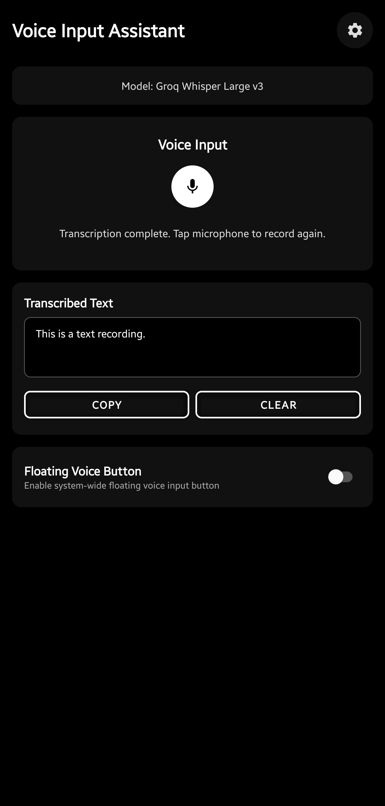

# 🎤 Voice Input Assistant - Android

A modern, AI-powered voice input replacement for Android that works system-wide across all apps. Transform your voice into text using AI models with a beautiful, intuitive interface.


## ✨ Features

### 🎯 **System-Wide Voice Input**
- Replace your Android keyboard with AI-powered voice input
- Works in **any app** that accepts text input (WhatsApp, Gmail, Notes, etc.)
- Custom Input Method Service (IME) integration
- Accessibility Service for advanced system integration

### 🤖 **Multiple AI Models**
- **OpenAI Whisper**: Industry-leading accuracy, 99+ languages
- **Google Gemini Speech**: Fast and efficient processing  
- **Groq Whisper Large V3**: Super fast and efficient models.
### 🎨 **Modern UI/UX**
- Material Design 3 components
- Animated voice visualizer with 4 synchronized bars
- Real-time recording indicators
- Smooth transitions and micro-interactions
- Rounded overlay with clean, minimal design

### 🔧 **Smart Features**¬º
- **Tap-to-stop**: Touch anywhere on the animation to stop recording
- **Auto-start recording**: Configurable automatic recording when overlay opens
- **Processing feedback**: Clear visual indicators during transcription
- **Error handling**: Graceful error messages and recovery
- **Theme support**: Multiple UI themes

## 📱 Screenshots




## 🚀 Quick Start

### Prerequisites
- Android 7.0 (API level 24) or higher
- Microphone permission
- System overlay permission
- Internet connection for AI processing

### Installation

1. **Download the APK** from the [Releases](../../releases) page (currently not available, requires building yourself)
2. **Enable "Install from unknown sources"** in your device settings
3. **Install the APK** and grant required permissions
4. **Configure your AI model** in the app settings
5. **Enable the input method** in Android Settings > System > Languages & input > Virtual keyboard

### Setup Guide

1. **Choose your AI provider** (OpenAI, Google or Groq)
2. **Add your API key** in the settings
3. **Test the voice input** using the in-app test feature
4. **Enable system-wide usage** by selecting the app as your default keyboard

## 🛠️ Configuration

### Current Supported AI Models

| Provider | Model | Languages | Speed | Accuracy |
|----------|-------|-----------|-------|----------|
| OpenAI | Whisper/GPT4o-transcribe | 99+ | ⭐⭐⭐ | ⭐⭐⭐⭐⭐ |
| Google | Gemini Speech | 100+ | ⭐⭐⭐⭐ | ⭐⭐⭐⭐ |
| Groq| Whisper Large v3 | 85+ | ⭐⭐⭐⭐⭐  | ⭐⭐⭐⭐ |


### API Key Setup

#### OpenAI Whisper
1. Get your API key from [OpenAI Platform](https://platform.openai.com/api-keys)
2. Add it in Settings > AI Configuration > OpenAI API Key

#### Google Gemini
1. Get your API key from [Google AI Studio](https://makersuite.google.com/app/apikey)
2. Add it in Settings > AI Configuration > Google API Key

#### Groq
1. Get your API key from [Groq Console](https://console.groq.com/keys)
2. Add it in Settings > AI Configuration > Groq API Key


## 🏗️ Architecture

### Tech Stack
- **Language**: Kotlin
- **UI Framework**: Android Views with Material Design 3
- **Architecture**: MVVM with ViewModels and LiveData
- **Dependency Injection**: Hilt
- **Networking**: Retrofit + OkHttp
- **Audio Processing**: Android MediaRecorder
- **Animations**: Custom Canvas drawing + ValueAnimator

### Key Components
- **VoiceRecognitionActivityModern**: Main overlay interface
- **AudioVisualizerView**: Custom animated voice bars
- **VoiceInputRepository**: AI model integration
- **ConfigurationManager**: Settings and preferences
- **FloatingVoiceService**: System overlay service

## 🎨 UI Components

### Voice Visualizer
- 4 synchronized animated bars
- Real-time amplitude visualization
- Smooth transitions and organic movement
- Tap-to-stop functionality

### Overlay Design
- Rounded corners (16dp radius)
- Semi-transparent background
- Centered layout with proper spacing
- Material Design floating action buttons

## 🔧 Development

### Building from Source

```bash
# Clone the repository
git clone https://github.com/yourusername/voice-input-assistant.git
cd voice-input-assistant

# Build debug APK
./gradlew assembleDebug

# Build release APK
./gradlew assembleRelease
```

### Requirements
- Android Studio Arctic Fox or newer
- JDK 11 or 17
- Android SDK 34
- Gradle 8.0+

### Project Structure
```
app/
├── src/main/
│   ├── java/com/voiceinput/assistant/
│   │   ├── ui/                 # Activities and custom views
│   │   ├── data/               # Repositories and data sources
│   │   ├── viewmodels/         # ViewModels
│   │   └── services/           # Background services
│   └── res/
│       ├── layout/             # XML layouts
│       ├── drawable/           # Vector drawables and shapes
│       └── values/             # Themes, colors, strings
```

## 🤝 Contributing

We welcome contributions! Please see our [Contributing Guidelines](CONTRIBUTING.md) for details.

### Development Setup
1. Fork the repository
2. Create a feature branch (`git checkout -b feature/amazing-feature`)
3. Commit your changes (`git commit -m 'Add amazing feature'`)
4. Push to the branch (`git push origin feature/amazing-feature`)
5. Open a Pull Request

## 📄 License

This project is licensed under the MIT License - see the [LICENSE](LICENSE) file for details.

## 📞 Support

- 🐛 **Bug Reports**: [Issues](../../issues)
- 💡 **Feature Requests**: [Issues](../../issues)
- 📧 **Email**: ml.amirmusa@gmail.com
- 💬 **Discussions**: [GitHub Discussions](../../discussions)

## 🔮 Roadmap

- [ ] Offline voice recognition support
- [ ] Voice commands and shortcuts
- [ ] Multi-language switching
- [ ] Voice training and personalization
- [ ] Integration with more AI providers

---

<div align="center">

**⭐ Star this repository if you find it helpful!**

</div>